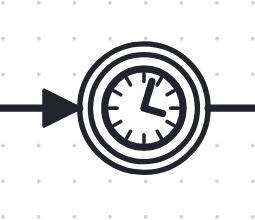
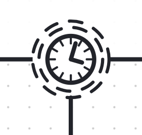

Maintained by &nbsp; 

&nbsp;

Contributors: &nbsp; 

&nbsp;

## List of Design Patterns

### Timer-Related

[ Updatable Timer Pattern](updatable-timer-pattern)

[ Updatable Boundary Timer Pattern](updatable-boundary-timer-pattern)

[ Recalculable Non-Interrupting Boundary Timer Pattern](recalculable-non-interrupting-boundary-timer-pattern)