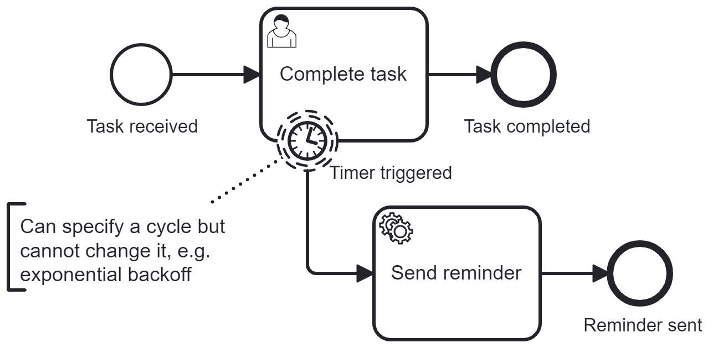
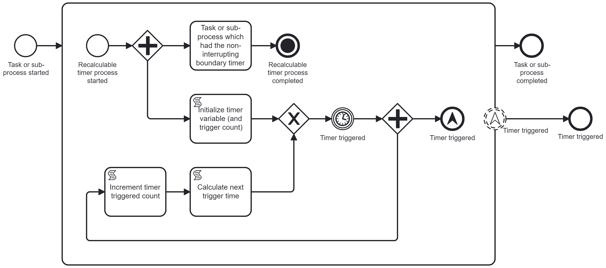
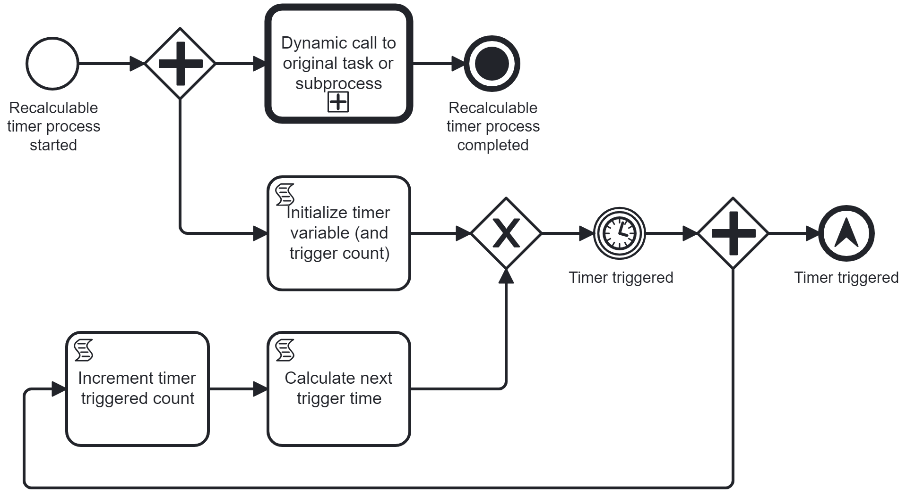

# Problem

# Solution: Recalculable Non-Interrupting Boundary Timer Pattern

Use an intermediate timer event with a dynamic value for its timer value. After being triggered, in parallel, throw an escalation and reinitialize the timer with a new timer value via a loop.

# Reusable Pattern

To easily implement this solution, this process blueprint is provided as a reusable pattern.

# Explanation

This reusable pattern can be applied to tasks and subprocesses. As a first step, the task or subprocess, to which the recalculable non-interrupting timer boundary event should be added, is extracted into a separate BPMN file. Next, in the place of the task or subprocess, a call activity is added, referencing the reusable pattern. The processId of the extracted task or subprocess is added to the input mapping of the call activity. This variable will be used for the **Dynamic call to original task or subprocess** call activity of the reusable pattern.

The timer value of the timer event is provided by a dynamic value, referencing a process variable called **durationValue**. In this solution, the intial value is set by a script task. Once the timer is triggered, the parallel gateway creates two tokens. One token triggers the escalation end event, which in turn in caught by the non-interrupting escalation boundary event in the parent process - a reminder is sent. The second token runs through two script tasks which calculate a new value for the process variable **durationValue**. Then, the timer is initialized with the new duration value.

# Installation Guide

The reusable pattern expects one input variable: **dynamicProcessId**

The **dynamicProcessId** is used in the **Dynamic call to original task or subprocess** call activity.

The script tasks can be used to configure the timer strategy. In the solution, an exponential backoff is implemented.

Please adapt the technical configurations as needed!
