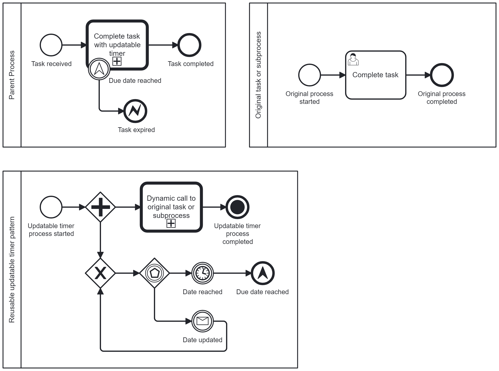

> **Detailed explanation in [English](https://www.brix.ch/en/about-us/news/avoid-typical-errors-in-process-models-through-design-patterns#updatable-boundary-timer-pattern) or [German](https://www.brix.ch/de/ueber-uns/news/vermeidung-typischer-fehler-in-prozessmodellen-durch-design-patterns#updatable-boundary-timer-pattern).**

# Problem

It is not possible to update the **dueDate** of the timer boundary event once the user task has been started.

# Solution: Updatable Boundary Timer Pattern

Stop and reinitialize the intermediate timer event. Use escalation events to convey the information that the **dueDate** has been reached.

# Reusable Pattern

To easily implement this solution, this process blueprint is provided as a reusable pattern.

# Explanation

This reusable pattern can be applied to tasks and subprocesses. As a first step, the task or subprocess, to which the updatable timer boundary event should be added, is extracted into a separate BPMN file. Next, in the place of the task or subprocess, a call activity is added, referencing the reusable pattern. The processId of the extracted task or subprocess is added to the input mapping of the call activity. This variable will be used for the **Dynamic call to original task or subprocess** call activity of the reusable pattern.

The timer value of the timer event is provided by a dynamic value, referencing a process variable called **dueDate**. By adding an event-based gateway, the initialized intermediate timer event can be stopped via a message correlation. The variable **dueDate** can be updated on message correlation. After the loop through the gateway, the timer event is initialized again, now using the updated value for the release date.

Once the **dueDate** has been reached, the escalation end event is triggered and can be caught on the parent scope.

# Installation Guide

The reusable pattern expects three input variables: **dynamicProcessId**, **dueDate**, and **correllationKey**.

The **dynamicProcessId** is used in the **Dynamic call to original task or subprocess** call activity.

The **dueDate** is the initial value for the intermediate timer event.

The message name is **updateTimerValue**. For correlation, it relies on a process variables called **correlationKey**.

Please adapt the technical configurations as needed, including input/output mappings.
