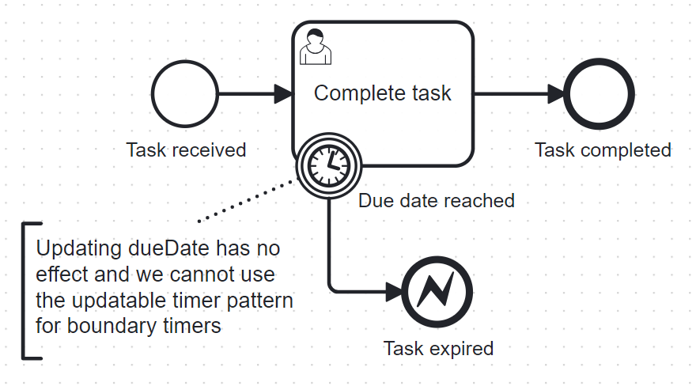

Detailed explanation in [English](https://www.brix.ch/en/about-us/news/avoid-typical-errors-in-process-models-through-design-patterns#updatable-boundary-timer-pattern) or [German](https://www.brix.ch/de/ueber-uns/news/vermeidung-typischer-fehler-in-prozessmodellen-durch-design-patterns#updatable-boundary-timer-pattern).

### Problem

### Solution: Updatable Boundary Timer Pattern

