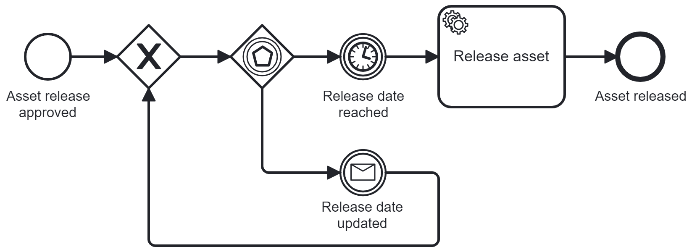

> **Detailed explanation in [English](https://www.brix.ch/en/about-us/news/avoid-typical-errors-in-process-models-through-design-patterns#updatable-timer-pattern) or [German](https://www.brix.ch/de/ueber-uns/news/vermeidung-typischer-fehler-in-prozessmodellen-durch-design-patterns#updatable-timer-pattern).**

# Problem

# Solution: Updatable Timer Pattern

Stop and reinitialize the intermediate timer event.

# Explanation

The timer value of the timer event is provided by a dynamic value, referencing a process variable called **releaseDate**. By adding an event-based gateway, the initialized intermediate timer event can be stopped via a message correlation. The variable **releaseDate** can be updated on message correlation. After the loop through the gateway, the timer event is initialized again, now using the updated value for the release date.

# Installation Guide

In the solution, the timer value is provided as a process variable called **releaseDate**. This process variable should be handed to the process instance on start or created later via a FEEL expression, e.g., **= now() + duration("P1D")**.

The message name is **updateTimerValue**. For correlation, it relies on a process variables called **correlationKey**.

The example service task is configured with a service task type **releaseAsset**.

Please adapt the technical configurations as needed, including input/output mappings.
